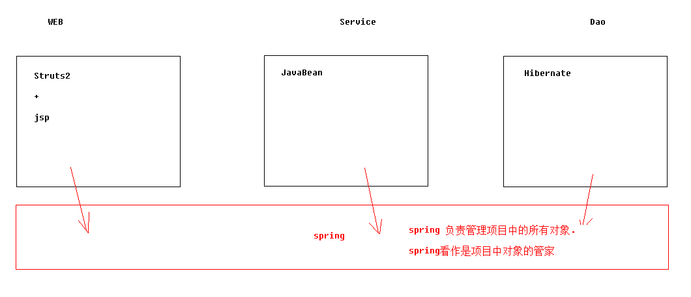
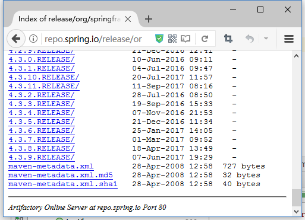
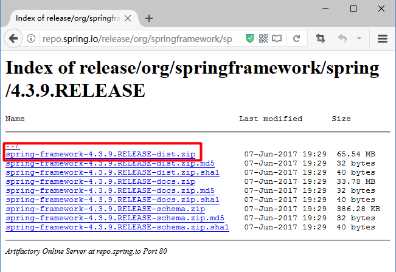

[TOC]

# 说明

这个是自己学习 spring的例子而已。

[SSH与SSM学习之Spring01——介绍、搭建环境与第一个例子](blog/01.md)

[SSH与SSM学习之Spring02——bean元素配置](blog/02.md)

[SSH与SSM学习之Spring03——Spring创建对象的方式](blog/03.md)

[SSH与SSM学习之Spring04——Spring属性注入之set方法注入](blog/04.md)

[SSH与SSM学习之Spring05——Spring属性注入之构造函数注入](blog/05.md)

[SSH与SSM学习之Spring06——Spring属性注入之p名称空间注入](blog/06.md)

[SSH与SSM学习之Spring07——Spring属性注入之spel注入](blog/07.md)

[SSH与SSM学习之Spring08——Spring属性注入之复杂类型注入](blog/08.md)

[SSH与SSM学习之Spring09——Spring使用注解配置](blog/09.md)

[SSH与SSM学习之Spring10——Spring与junit整合测试](blog/10.md)

[SSH与SSM学习之Spring11——Spring中的AOP](blog/11.md)

[SSH与SSM学习之Spring12——动态代理之实现](blog/12.md)

[SSH与SSM学习之Spring13——动态代理之通知的使用](blog/13.md)

[SSH与SSM学习之Spring14——动态代理之自己的AOP框架](blog/14.md)

----

或者查看blog

**[SSH与SSM学习](http://blog.csdn.net/qiwenmingshiwo/article/category/7175517)**

----


[TOC]

# SSH与SSM学习之Spring01——介绍、搭建环境与第一个例子

## 一、概述

Spring 是最受欢迎的企业级 Java 应用程序开发框架。数以百万的来自世界各地的开发人员使用 Spring 框架来创建好性能、易于测试、可重用的代码。

Spring 框架的核心特性可以用于开发任何 Java 应用程序，但是在 Java EE 平台上构建 web 应用程序是需要扩展的。 Spring 框架的目标是使 J2EE 开发变得更容易使用，通过启用基于 POJO 编程模型来促进良好的编程实践。

---

## 二、Spring在三成架构中的位置



---

## 三、Spring一站式框架

正是因为spring框架性质是属于容器性质的.

容器中装什么对象就有什么功能.所以可以一站式.

不仅不排斥其他框架,还能帮其他框架管理对象.

aop支持

ioc

spring jdbc

aop 事务

junit 测试支持

....

---

## 四、体系结构


核心容器

核心容器由核心，Bean，上下文和表达式语言模块组成，它们的细节如下：

- **Core 核心模块** 提供了框架的基本组成部分，包括 IoC 和依赖注入功能。
 
- **Bean 模块** 提供 BeanFactory，它是一个工厂模式的复杂实现。

- **Context上下文模块** 建立在由核心和 Bean 模块提供的坚实基础上，它是访问定义和配置的任何对象的媒介。ApplicationContext 接口是上下文模块的重点。

- **SpEl 表达式语言模块** 在运行时提供了查询和操作一个对象图的强大的表达式语言。

可以查看 https://www.w3cschool.cn/wkspring/dcu91icn.html

---

## 四、下载我们需要的jar包

我们可以去到官网下载 https://spring.io/

或者直接去到下面这个地址下载。

http://repo.spring.io/release/org/springframework/spring/

我选择的是 **4.3.9.RELEASE**






---

## 五、开始我们的第一个例子

### 5.1 导包

我们只需要最简单的功能，因此只需要导入去到我们下载以后解压的 **lib**中找到这些包(可以看上面的体系结构)，拷贝到测试的项目中就行了。

```
spring-beans-4.3.9.RELEASE.jar

spring-context-4.3.9.RELEASE.jar

spring-core-4.3.9.RELEASE.jar

spring-expression-4.3.9.RELEASE.jar
```

除此之外，还需要加入下面的包
```
commons-logging-1.2.jar
```
可以去这里下载

http://commons.apache.org/proper/commons-logging/download_logging.cgi

如果要使用 junit，那么请导入 junit jar包


### 5.2 创建使用的JaveBean User

```java
package com.qwm.spring1.bean;

import java.io.Serializable;

/**
 * @author: wiming
 * @date: 2017-09-25 14:45:56  星期一
 * @decription:
 */
public class User implements Serializable{
    private int age;
    private String name;

    public User() {
        System.out.println("---User实例化啦---");
    }

    public int getAge() {
        return age;
    }

    public void setAge(int age) {
        this.age = age;
    }

    public String getName() {
        return name;
    }

    public void setName(String name) {
        this.name = name;
    }
}

```


---

### 5.3 创建配置文件
在src下创建 **applicationContext.xml**（ 位置任意(建议放到src下)。
配置文件名任意(建议applicationContext.xml) ）。

配置上面创建的 User 类。

```xml
<?xml version="1.0" encoding="UTF-8" ?>
<beans xmlns:xsi="http://www.w3.org/2001/XMLSchema-instance" xmlns="http://www.springframework.org/schema/beans" xsi:schemaLocation="http://www.springframework.org/schema/beans http://www.springframework.org/schema/beans/spring-beans-4.2.xsd ">

    <!-- 将User对象交给spring容器管理 -->
    <!-- Bean元素:使用该元素描述需要spring容器管理的对象
            class属性:被管理对象的完整类名.
            name属性:给被管理的对象起个名字.获得对象时根据该名称获得对象.
                    可以重复.可以使用特殊字符.
            id属性: 与name属性一模一样.
                    名称不可重复.不能使用特殊字符.
            结论: 尽量使用name属性.
      -->
    <bean name="user" class="com.qwm.spring1.bean.User"></bean>

</beans>
```

---

### 5.4 示例代码

```java
package com.qwm.spring1.a_hello;

import com.qwm.spring1.bean.User;
import org.junit.Test;
import org.springframework.context.ApplicationContext;
import org.springframework.context.support.ClassPathXmlApplicationContext;

/**
 * @author: wiming
 * @date: 2017-09-25 14:51:06  星期一
 * @decription:
 * 第一个示例
 */
public class Demo1 {
    @Test
    public void test1(){
        //创建容器对象
        ApplicationContext context = new ClassPathXmlApplicationContext("applicationContext.xml");
        //获取User的对象
        User user = (User)context.getBean("user");
        //打印
        System.out.println(user);
    }
}

```

---

### 5.5 结果

```
---User实例化啦---
com.qwm.spring1.bean.User@7b49cea0
```

---

## 六、applicationContext和BeanFactory

### 6.1 BeanFactory接口

spring原始接口.针对原始接口的实现类功能较为单一

BeanFactory接口实现类的容器.特点是每次在获得对象时才会创建对象


### 6.2 ApplicationContext

每次容器启动时就会创建容器中配置的所有对象.并提供更多功能

丛类路径下加载配置文件:ClassPathXmlApplicationContext

从硬盘绝对路径下加载配置文件:FileSystemXmlApplicationContext("d:/xxx/yyy/xxx")


### 6.3 结论

结论:web开发中,使用applicationContext. 在资源匮乏的环境可以使用BeanFactory.