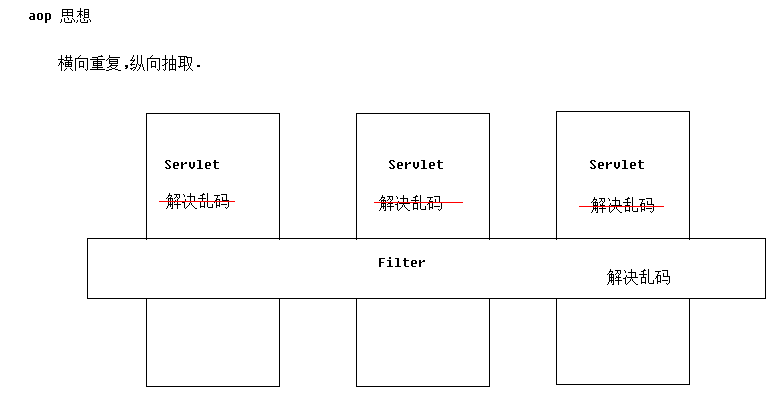
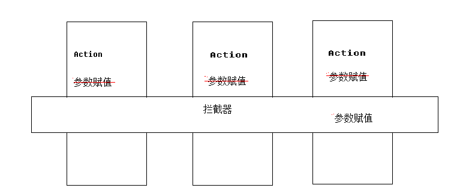
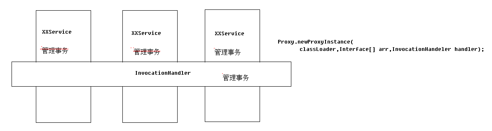
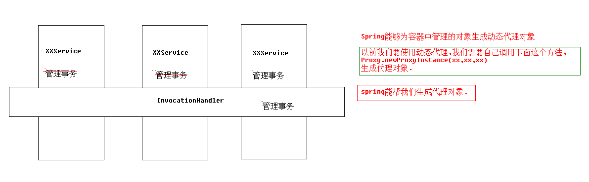

[TOC]

# SSH与SSM学习之Spring11——Spring中的AOP

## 一、AOP
在软件业，AOP为Aspect Oriented Programming的缩写，意为：面向切面编程，

通过预编译方式和运行期动态代理实现程序功能的统一维护的一种技术。

AOP是OOP的延续，是软件开发中的一个热点，也是Spring框架中的一个重要内容，

是函数式编程的一种衍生范型。利用AOP可以对业务逻辑的各个部分进行隔离，

从而使得业务逻辑各部分之间的耦合度降低，提高程序的可重用性，同时提高了开发的效率。

---

## 二、AOP思想介绍

AOP 思想就是：横向重复，纵向提取。

例如，过滤器的使用。为了解决乱码问题，我们可以在每个Servlet上添加解决乱码的代码，

但是这种处理方式麻烦，而且不利于修改。这个使用我们使用了过滤器统一处理，把Servlet

中处理乱码的代码，提取到了过滤器中来，如果不需要处理了，那么直接删除过滤器的配置就行可以了。

再例如，之前在 **Struts2** 中，给 **Action** 赋值的操作，虽然是Struts2 来完成的，

但是，我们可以看到它其实是使用了拦截器来操作的。赋值这个部分的代码是Action中都用使用

到的，如果不使用拦截器，我们就得一个一个的来赋值，使用了拦截器，就把这些代码提取了出来，

这样以后修改也是很方便的。

再例如，我们的Service操作DAO的时候，需要开启和关闭事务，这样每个方法都需要添加上事务的管理，

如果我们是自己来一个一个的写，那是很麻烦的，可以使用代理的方式来解决这个问题。

---

## 三、Spring中的AOP概念

Spring中的AOP,其实就是为我们提供代理对象。例如上面的事务管理：

---

## 四、Spring实现AOP的原理

Spring实现AOP其实就是生成代理对象。使用到的代理技术有两种

- 动态代理(优先使用这种方式)
> 被代理对象必须要实现接口,才能产生代理对象.如果没有接口将不能使用动态代理技术

- cglib代理(没有接口时使用这种方式)
> 第三方代理技术,cglib代理.可以对任何类生成代理.代理的原理是对目标对象进行继承代理. 如果目标对象被final修饰.那么该类无法被cglib代理. 
> 这就是 Hibernate 中 实体不能被 final 修饰的原因。

---

## 五、AOP相关的名称

| 名称 | 说明 |
|---|---|
| Joinport(连接点) |目标对象中，所有可以增强的方法|
| Pointcut(切入点) | 目标对象中，已经增强的方法 |
| Advice(通知/增强) | 增强的代码 |
| Target(目标对象) | 被代理对象 |
| Weaving(织入) | 将通知应用到切入点的过程 |
| Proxy(代理) | 将通知织入到目标对象以后，形成代理对象 |
| Aspect(切面) | 切入点 + 通知 |

**Advice(通知/增强):所谓通知是指拦截到 Joinpoint 之后所要做的事情就是通知.通知分为前置通知,后置
  通知,异常通知,最终通知,环绕通知(切面要完成的功能)**