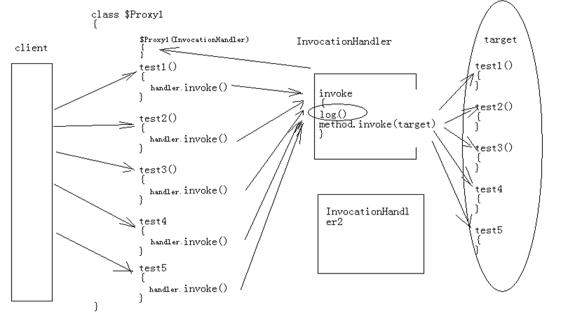

[TOC]

# SSH与SSM学习之Spring13——动态代理之通知的使用

## 一、说明

前面的动态代理实现中，我们实现了方法调用前后打印数据的需求。但是我们的打印是死的，如果我换成不是打印了是其他处理就不行了。如下图



如果在上图中的 log()是一个对象，处理的时候调用对象的方法，那么问题不就解决了吗。


---

## 二、实现

上面所说的操作方式。实现步骤如下：

1. 创建一个抽象类 **Advice**,这个抽象类中定义一些方法，比如调用前，调用后等。如下

```java
package com.qwm.spring2.c_proxy;
import java.lang.reflect.Method;

/**
 * @author：qiwenming
 * @date：2017/10/24 0024   22:20
 * @description：
 * 通知抽象类
 */
public abstract class Advice {
    /**
     * 方法调用之前（前置通知）
     */
    public void before(){}

    /**
     * 方法调用之后（后置通知）
     * 异常了不会调用
     */
    void afterReturning(){}

    /**
     * 可以自己调用方法（环绕通知）
     */
    void around(Object proxy, Method method, Object[] args){}

    /**
     * 异常时候调用（异常通知）
     */
    void afterException(){}

    /**
     * 方法调用之后（后置通知）
     * 异常了也会调用
     */
    void after(){}
}

```

2. 创建一个生成代理类的方法，这个方法中需要传递目标对象和上面的通知（Advice）的实现类。
在代理前后调用 通知的相应方法。如下

```java
package com.qwm.spring2.c_proxy;

import java.lang.reflect.InvocationHandler;
import java.lang.reflect.Method;
import java.lang.reflect.Proxy;

/**
 * @author：qiwenming
 * @date：2017/10/24 0024   22:28
 * @description：
 * 获取代理
 */
public class ProxyFactory {
    public static Object getProxyObject(Object target,Advice advice){
        if(target==null){
            throw new IllegalArgumentException("target can not null");
        }
        return Proxy.newProxyInstance(target.getClass().getClassLoader(), target.getClass().getInterfaces(), new InvocationHandler() {
            @Override
            public Object invoke(Object proxy, Method method, Object[] args) throws Throwable {
                Object obj = null;
                if(advice==null){//如果没有通知，那么直接调用
                    obj = method.invoke(target,args);
                }else{
                    advice.before();
                    try {
                        advice.around(target, method, args);
                        obj = method.invoke(target, args);
                        advice.afterReturning();
                        advice.after();
                    }catch (Exception e){
//                        e.printStackTrace();
                        advice.after();
                        advice.afterException();
                    }
                }
                return obj;
            }
        });
    }
}
```

----

## 三、测试

上面我们实现了，通过传入来处理通知。现在来测试一把

测试代码一

```java
@Test
    public void test2(){
        IUser iu = (IUser)ProxyFactory.getProxyObject(new IUser() {
            @Override
            public void saveUser() {

            }

           @Override
           public void delete() {
               System.out.println("删除用户");
           }
        }, new Advice() {
            @Override
            public void before() {
                System.out.println("------before----");
            }

            @Override
            void after() {
                System.out.println("-----after-----");
            }
        });

        iu.delete();
    }
```

结果

```
------before----
删除用户
-----after-----
```

更多的处理，请看源码

[https://github.com/wimingxxx/spring01/tree/master/src/com/qwm/spring2/c_proxy](https://github.com/wimingxxx/spring01/tree/master/src/com/qwm/spring2/c_proxy)
