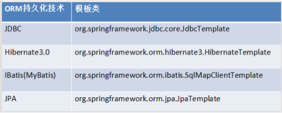
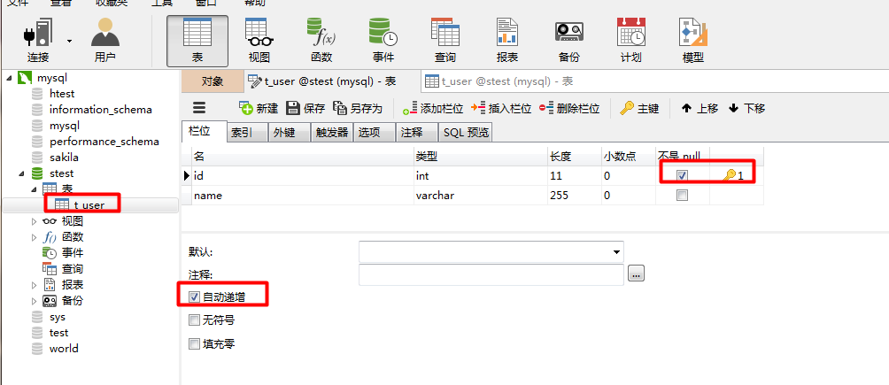
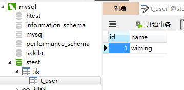
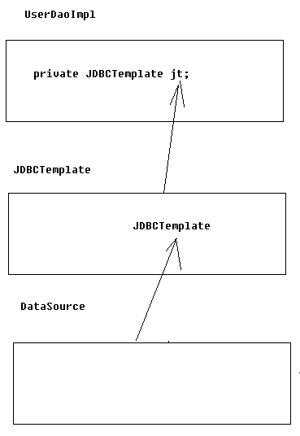
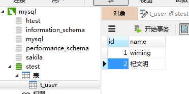
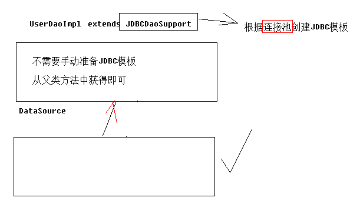
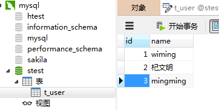

[TOC]

# SSH与SSM学习之Spring18——Spring整合JDBC

## 一、说明

spring就是一个容器，我们整合JDBC就是添加相应的对象。

spring提供了很多模板整合Dao技术。如下图



spring中提供了一个可以操作数据库的对象.对象封装了jdbc技术.这个类是

**JdbcTemplate**

JdbcTemplate 与DBUtils中的QueryRunner非常相似.

---

## 二、导包

### 2.1 Spring核心包
```xml
spring-beans

spring-context

spring-core

spring-expression
```


### 2.2 日志包

```xml
commons-logging

log4j
```

### 2.3 测试包

```xml
junit4

hamcrest

spring-test
```

### 2.4 Spring AOP包
```xml
spring-aop

spring-aspects

org.aspectj.weaver

org.aopalliance
```

### 2.5 c3p0连接池 和 JDBC驱动

```xml
com.mchange.v2.c3p0

mysql-connector
```

### 2.6 Spring中jdbc和事务包
```xml
spring-jdbc

spring-tx
```

---

## 三、创建 User 数据类

```java

package com.qwm.spring3.bean;

/**
 * @author：qiwenming
 * @date：2017/10/26 0026   21:47
 * @description：
 */
public class User {
    private Integer id;
    private String name;

    public Integer getId() {
        return id;
    }

    public void setId(Integer id) {
        this.id = id;
    }

    public String getName() {
        return name;
    }

    public void setName(String name) {
        this.name = name;
    }

    @Override
    public String toString() {
        return "User{" +
                "id=" + id +
                ", name='" + name + '\'' +
                '}';
    }
}

```

---

## 四、创建测试用的表 t_user

```java
CREATE TABLE `t_user` (
  `id` int(11) NOT NULL AUTO_INCREMENT,
  `name` varchar(255) DEFAULT NULL,
  PRIMARY KEY (`id`)
) ENGINE=InnoDB AUTO_INCREMENT=5 DEFAULT CHARSET=utf8;
```




---

## 五、纯粹的使用 JdbcTemplate 操作数据库

```java
    /**
     * 不使用配置文件，直接调用JdbcTemplate来完成
     * @throws Exception
     */
    @Test
    public void test1() throws Exception{
        //1.准备连接池
        ComboPooledDataSource dataSource = new ComboPooledDataSource();
        dataSource.setJdbcUrl("jdbc:mysql:///stest");
        dataSource.setDriverClass("com.mysql.jdbc.Driver");
        dataSource.setUser("root");
        dataSource.setPassword("xm123456");

        //2.创建JDBC模板
        JdbcTemplate jdbcTemplate = new JdbcTemplate();
        jdbcTemplate.setDataSource(dataSource);

        //3.书写sql并且执行
        String sql = "insert into t_user values(null,'wiming')";
        jdbcTemplate.execute(sql);
    }
````

结果是



---

## 六、书写DAO

### 6.1 UserDao

```java
package com.qwm.spring3.dao;

import com.qwm.spring3.bean.User;
import java.util.List;
/**
 * @author：qiwenming
 * @date：2017/10/26 0026   21:48
 * @description：
 */
public interface UserDao {
    //增
    void save(User u);
    //删
    void delete(Integer id);
    //改
    void update(User u);
    //查
    User getById(Integer id);
    //查
    int getTotalCount();
    //查
    List<User> getAll();
}

```

---

### 6.2 UserDaoImpl

这个类实现了 UserDao 接口。在这个类中，我们创建一个 JdbcTemplate，

用于操作数据库，我们使用配置文件配置注入。

```java
package com.qwm.spring3.dao;

import com.qwm.spring3.bean.User;
import org.springframework.jdbc.core.JdbcTemplate;
import org.springframework.jdbc.core.RowMapper;

import java.sql.ResultSet;
import java.sql.SQLException;
import java.util.List;

/**
 * @author：qiwenming
 * @date：2017/10/26 0026   21:49
 * @description：
 * 使用JDBC模板实现增删改查
 */
public class UserDaoImpl implements UserDao{
    private JdbcTemplate jt;

    public JdbcTemplate getJt() {
        return jt;
    }

    public void setJt(JdbcTemplate jt) {
        this.jt = jt;
    }

    @Override
    public void save(User u) {
        String sql = "insert into t_user values(null,?)";
        jt.update(sql,u.getName());
    }

    @Override
    public void delete(Integer id) {
        String sql = "delete from t_user where id=?";
        jt.update(sql,id);
    }

    @Override
    public void update(User u) {
        String sql = "update t_user set name=? where id=?";
        jt.update(sql,u.getName(),u.getId());
    }

    @Override
    public User getById(Integer id) {
        String sql = "select * from t_user where id=?";
        return jt.queryForObject(sql, new RowMapper<User>() {
            @Override
            public User mapRow(ResultSet resultSet, int index) throws SQLException {
                User u = new User();
                u.setId(resultSet.getInt("id"));
                u.setName(resultSet.getString("user"));
                return u;
            }
        }, id);
    }

    @Override
    public int getTotalCount() {
        String sql = "select count(*) from t_user";
        int count = jt.queryForObject(sql,Integer.class);
        return count;
    }

    @Override
    public List<User> getAll() {
        String sql = "select * from t_user";
        return jt.query(sql, new RowMapper<User>() {
            @Override
            public User mapRow(ResultSet resultSet, int i) throws SQLException {
                User user = new User();
                user.setId( resultSet.getInt("id") );
                user.setName( resultSet.getString("name") );
                return user;
            }
        });
    }
}

```

---

## 七、applicationContext.xml Spring配置

UserDaoImpl、JdbcTemplate 和 DataSource 三者的依赖关系如下



通过上面的依赖关系，我们可以很轻松的配置中的顺序了。

1.配置 DataSource

2.配置 JdbcTemplate，把配置好的 DataSource 注入到  JdbcTemplate中

3.配置 UserDaoImpl

```xml
<?xml version="1.0" encoding="UTF-8" ?>
<beans xmlns:xsi="http://www.w3.org/2001/XMLSchema-instance"
       xmlns="http://www.springframework.org/schema/beans"
       xmlns:context="http://www.springframework.org/schema/context"
       xsi:schemaLocation="http://www.springframework.org/schema/beans http://www.springframework.org/schema/beans/spring-beans-4.2.xsd http://www.springframework.org/schema/context http://www.springframework.org/schema/context/spring-context.xsd">

    <!--1. 将连接池放入到spring容器中-->
    <bean name="dataSource" class="com.mchange.v2.c3p0.ComboPooledDataSource">
        <property name="jdbcUrl" value="jdbc:mysql:///stest"/>
        <property name="driverClass" value="com.mysql.jdbc.Driver"/>
        <property name="user" value="root"/>
        <property name="password" value="xm123456"/>
    </bean>

    <!--2. 将JdbcTemplate放入到spring容器中-->
    <bean name="jdbcTemplate" class="org.springframework.jdbc.core.JdbcTemplate">
        <property name="dataSource" ref="dataSource"/>
    </bean>

    <!--3. 将UserDaoImpl放入到容器中-->
    <bean name="userDao" class="com.qwm.spring3.dao.UserDaoImpl">
        <property name="jt" ref="jdbcTemplate"/>
    </bean>

</beans>
```

---

## 八、测试

```java
/**
 * @author：qiwenming
 * @date：2017/10/26 0026   21:23
 * @description：
 * jdbc测试
 */
@RunWith(SpringJUnit4ClassRunner.class)
@ContextConfiguration("classpath:com/qwm/spring3/applicationContext.xml")
public class Demo {

    @Resource(name = "userDao")
    private UserDao ud;
    @Test
    public void test2(){
        User user = new User();
        user.setName("杞文明");
        ud.save(user);
    }

    @Test
    public void test3(){
        List<User> list = ud.getAll();
        System.out.println(list);
    }

}
```

test2的测试结果




test3的测试结果

```
[User{id=1, name='wiming'}, User{id=2, name='杞文明'}]
```

---

## 九、UserDao的实现类继承 JdbcDaoSupport

继承 JdbcDaoSupport 我们可以不用我们自己注入 JdbcTemplate。JdbcDaoSupport 中已经帮我们好了

### 9.1 UserDaoImpl2 类继承JdbcDaoSupport

```java
package com.qwm.spring3.dao;

import com.qwm.spring3.bean.User;
import org.springframework.jdbc.core.JdbcTemplate;
import org.springframework.jdbc.core.RowMapper;
import org.springframework.jdbc.core.support.JdbcDaoSupport;

import java.sql.ResultSet;
import java.sql.SQLException;
import java.util.List;

/**
 * @author：qiwenming
 * @date：2017/10/26 0026   21:49
 * @description：
 * 使用JDBC模板实现增删改查
 */
public class UserDaoImpl2 extends JdbcDaoSupport implements UserDao{

    @Override
    public void save(User u) {
        String sql = "insert into t_user values(null,?)";
        super.getJdbcTemplate().update(sql,u.getName());
    }

    @Override
    public void delete(Integer id) {
        String sql = "delete from t_user where id=?";
        super.getJdbcTemplate().update(sql,id);
    }

    @Override
    public void update(User u) {
        String sql = "update t_user set name=? where id=?";
        super.getJdbcTemplate().update(sql,u.getName(),u.getId());
    }

    @Override
    public User getById(Integer id) {
        String sql = "select * from t_user where id=?";
        return super.getJdbcTemplate().queryForObject(sql, new RowMapper<User>() {
            @Override
            public User mapRow(ResultSet resultSet, int index) throws SQLException {
                User u = new User();
                u.setId(resultSet.getInt("id"));
                u.setName(resultSet.getString("user"));
                return u;
            }
        }, id);
    }

    @Override
    public int getTotalCount() {
        String sql = "select count(*) from t_user";
        int count = super.getJdbcTemplate().queryForObject(sql,Integer.class);
        return count;
    }

    @Override
    public List<User> getAll() {
        String sql = "select * from t_user";
        return super.getJdbcTemplate().query(sql, new RowMapper<User>() {
            @Override
            public User mapRow(ResultSet resultSet, int i) throws SQLException {
                User user = new User();
                user.setId( resultSet.getInt("id") );
                user.setName( resultSet.getString("name") );
                return user;
            }
        });
    }
}

```

---

### 9.2 依赖关系



通过上面的步骤我们发现，和之前相比，我们少了配置 JdbcTemplate 这一步。

---

### 9.3 applicationContext.xml

```xml
<?xml version="1.0" encoding="UTF-8" ?>
<beans xmlns:xsi="http://www.w3.org/2001/XMLSchema-instance"
       xmlns="http://www.springframework.org/schema/beans"
       xmlns:context="http://www.springframework.org/schema/context"
       xsi:schemaLocation="http://www.springframework.org/schema/beans http://www.springframework.org/schema/beans/spring-beans-4.2.xsd http://www.springframework.org/schema/context http://www.springframework.org/schema/context/spring-context.xsd">

    <!--1. 将连接池放入到spring容器中-->
    <bean name="dataSource" class="com.mchange.v2.c3p0.ComboPooledDataSource">
        <property name="jdbcUrl" value="jdbc:mysql:///stest"/>
        <property name="driverClass" value="com.mysql.jdbc.Driver"/>
        <property name="user" value="root"/>
        <property name="password" value="xm123456"/>
    </bean>

    <!--2.继承了 JdbcDaoSupport 类的 Dao 的配置，我们可以不用配置配置 JdbcTemplate-->
    <bean name="userDao2" class="com.qwm.spring3.dao.UserDaoImpl2">
        <property name="dataSource" ref="dataSource"/>
    </bean>

</beans>
```

### 9.4 测试方法

```
@RunWith(SpringJUnit4ClassRunner.class)
@ContextConfiguration("classpath:com/qwm/spring3/applicationContext.xml")
public class Demo {
    //----------------UserDaoImpl的调用--------------
    @Resource(name = "userDao2")
    private UserDao ud2;

    @Test
    public void test4(){
        User user = new User();
        user.setName("mingming");
        ud2.save(user);
    }

    @Test
    public void test5(){
        List<User> list = ud2.getAll();
        System.out.println(list);
    }
 }
```

test4的测试结果




test5的测试结果

```
[User{id=1, name='wiming'}, User{id=2, name='杞文明'}, User{id=3, name='mingming'}]
```


---

## 十、读取外部的Properties配置

由于我们数据库的配置可能会随时修改，我们一个把它放到 properties 中，然后在配置文件中来读取。

创建一个配置文件 **db.properties**

```java
jdbc.jdbcUrl=jdbc:mysql:///stest
jdbc.driverClass=com.mysql.jdbc.Driver
jdbc.user=root
jdbc.password=xm123456
```

配置文件通过
```xml
    <!-- 指定spring读取db.properties配置 -->
    <context:property-placeholder location="classpath:com/qwm/spring3/db.properties"/>
```
来读取。

使用的时候通过

```java
${}
```
来读取

完整的配置是

```xml
<?xml version="1.0" encoding="UTF-8" ?>
<beans xmlns:xsi="http://www.w3.org/2001/XMLSchema-instance"
       xmlns="http://www.springframework.org/schema/beans"
       xmlns:context="http://www.springframework.org/schema/context"
       xsi:schemaLocation="http://www.springframework.org/schema/beans http://www.springframework.org/schema/beans/spring-beans-4.2.xsd http://www.springframework.org/schema/context http://www.springframework.org/schema/context/spring-context.xsd">

    <!-- 指定spring读取db.properties配置 -->
    <context:property-placeholder location="classpath:com/qwm/spring3/db.properties"/>

    <!-- 1.将连接池放入spring容器 -->
    <bean name="dataSource" class="com.mchange.v2.c3p0.ComboPooledDataSource">
        <property name="jdbcUrl" value="${jdbc.jdbcUrl}"/>
        <property name="driverClass" value="${jdbc.driverClass}"/>
        <property name="user" value="${jdbc.user}"/>
        <property name="password" value="${jdbc.password}"/>
    </bean>

    <!--2.继承了 JdbcDaoSupport 类的 Dao 的配置，我们可以不用配置配置 JdbcTemplate-->
    <bean name="userDao2" class="com.qwm.spring3.dao.UserDaoImpl2">
        <property name="dataSource" ref="dataSource"/>
    </bean>

</beans>
```