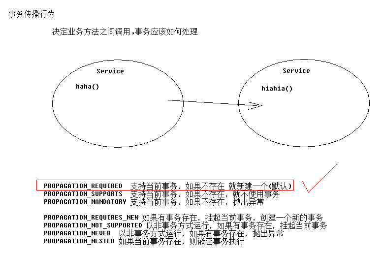

[TOC]

# SSH与SSM学习之Spring20——Spring事务之Spring相关的基础

## 一、 PlatformTransactionManager 接口

因为在不同平台,操作事务的代码各不相同。所以spring提供了一个接口 **PlatformTransactionManager**

Spring中，事务管理最重要的就是 **TransactionManager对象**

例如：PlatformTransactionManager的实现类

**DataSourceTransactionManager**  jdbc事务管理

**HibernateTransitionmanager**  hibernate事务管理

---

## 二、Spring事务管理的属性

### 2.1 事务隔离级别 isolation

事务的隔离级别
> 1 读未提交
>
> 2 读提交
>
> 4 可重复读
>
> 8 串行化

isolation表示事务的隔离级别，对应的值是
> 1 READ_UNCOMMITTED  读未提交
>
> 2 READ_COMMITTED  读提交
>
> 4 REPEATABLE_READ  可重复读
>
> 8 SERIALIZABLE  串行化

在Spring中定义的其实是一个枚举

```java
public enum Isolation {

	DEFAULT(TransactionDefinition.ISOLATION_DEFAULT),

	READ_UNCOMMITTED(TransactionDefinition.ISOLATION_READ_UNCOMMITTED),

	READ_COMMITTED(TransactionDefinition.ISOLATION_READ_COMMITTED),

	REPEATABLE_READ(TransactionDefinition.ISOLATION_REPEATABLE_READ),

	SERIALIZABLE(TransactionDefinition.ISOLATION_SERIALIZABLE);

	private final int value;
	Isolation(int value) { this.value = value; }

	public int value() { return this.value; }
}
```

```java
public interface TransactionDefinition {
    ...........
	int ISOLATION_DEFAULT = -1;

	int ISOLATION_READ_UNCOMMITTED = Connection.TRANSACTION_READ_UNCOMMITTED;

	int ISOLATION_READ_COMMITTED = Connection.TRANSACTION_READ_COMMITTED;

	int ISOLATION_REPEATABLE_READ = Connection.TRANSACTION_REPEATABLE_READ;

	int ISOLATION_SERIALIZABLE = Connection.TRANSACTION_SERIALIZABLE;
	...........
}
```


```java
public interface Connection  extends Wrapper, AutoCloseable{
    ......
    int TRANSACTION_READ_UNCOMMITTED = 1;

    int TRANSACTION_READ_COMMITTED   = 2;

    int TRANSACTION_REPEATABLE_READ  = 4;

    int TRANSACTION_SERIALIZABLE     = 8;
    ......
}
```

### 2.2 事务传播行为 propagation

<!-- 以方法为单位,指定方法应用什么事务属性
                isolation:隔离级别
                propagation:传播行为
                read-only:是否只读
-->

事务的传播行为指的是，多个业务方法嵌套条用，各自有操作了数据，它们之间事务的管理问题。

如图所示，多数情况下使用的是 **PROPAGATION_REQUIRED** 或者说 **REQUIRED**




```
PROPAGION_XXX :事务的传播行为

* 保证同一个事务中
PROPAGATION_REQUIRED 支持当前事务，如果不存在 就新建一个(默认)
PROPAGATION_SUPPORTS 支持当前事务，如果不存在，就不使用事务
PROPAGATION_MANDATORY 支持当前事务，如果不存在，抛出异常

* 保证没有在同一个事务中
PROPAGATION_REQUIRES_NEW 如果有事务存在，挂起当前事务，创建一个新的事务
PROPAGATION_NOT_SUPPORTED 以非事务方式运行，如果有事务存在，挂起当前事务传智播客——专注于 Java、 .Net 和 Php、网页平面设计工程师的培训
PROPAGATION_NEVER 以非事务方式运行，如果有事务存在，抛出异常
PROPAGATION_NESTED 如果当前事务存在，则嵌套事务执行
```


### 2.3 是否只读 read-only

这个属性配置，当前的事务是否是只读的，true为只读，false为可写。如果是只读，事务中有写操作是会报错的。