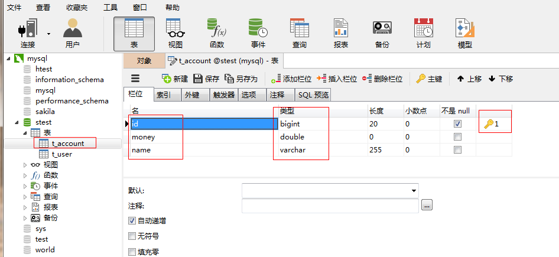
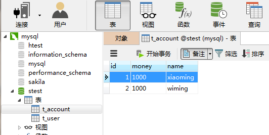
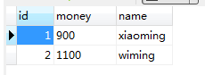

[TOC]

# SSH与SSM学习之Spring21——Spring事务之代码方式管理事务(基本不用)

## 一、说明

这种方式管理事务，就是在写代码来管理事务，这种方式基本不用。


---

## 二、准备数据库表和数据

创建一张 t_account 表

```sql
CREATE TABLE `t_account` (
  `id` bigint(20) NOT NULL AUTO_INCREMENT,
  `money` double DEFAULT NULL,
  `name` varchar(255) DEFAULT NULL,
  PRIMARY KEY (`id`)
) ENGINE=InnoDB AUTO_INCREMENT=3 DEFAULT CHARSET=utf8;
```

或者如图



准备数据如下



------

## 三、DAO相关接口和实现类

### 3.1 AccountDAO
```java
package com.qwm.spring3.tx.dao;

/**
 * @author：qiwenming
 * @date：2017/10/31 0031   20:48
 * @description：
 */
public interface AccountDao {
    /**
     * 加钱
     * @param id
     * @param money
     */
    void increaseMoney(Long id,double money);

    /**
     * 减钱
     * @param id
     * @param money
     */
    void decreaseMoney(Long id,double money);
}

```

### 3.2 AccountDaoImpl
```java
package com.qwm.spring3.tx.dao;

import org.springframework.jdbc.core.support.JdbcDaoSupport;

/**
 * @author：qiwenming
 * @date：2017/10/31 0031   20:49
 * @description：
 */
public class AccountDaoImpl extends JdbcDaoSupport implements AccountDao{
    @Override
    public void increaseMoney(Long id, double money) {
        getJdbcTemplate().update("update t_account set money=money+? where id=?",money,id);
    }

    @Override
    public void decreaseMoney(Long id, double money) {
        getJdbcTemplate().update("update t_account set money=money-? where id=?",money,id);
    }
}

```


---


### 四、Service相关接口和实现类

### 4.1 AccountSevice
```java
package com.qwm.spring3.tx.service;

/**
 * @author：qiwenming
 * @date：2017/10/31 0031   21:00
 * @description：
 */
public interface AccountService {
    void updateMoney(Long fromId , Long toId, Double money);
}

```

### 4.2 AccountSeviceImpl
```java
package com.qwm.spring3.tx.service;

import com.qwm.spring3.tx.dao.AccountDao;
import org.springframework.transaction.TransactionStatus;
import org.springframework.transaction.annotation.Isolation;
import org.springframework.transaction.annotation.Propagation;
import org.springframework.transaction.annotation.Transactional;
import org.springframework.transaction.support.TransactionCallback;
import org.springframework.transaction.support.TransactionCallbackWithoutResult;
import org.springframework.transaction.support.TransactionTemplate;

/**
 * @author：qiwenming
 * @date：2017/10/31 0031   21:02
 * @description：
 */
public class AccountServiceImpl implements AccountService {

    private AccountDao ad;
    private TransactionTemplate tt;

    @Override
    public void updateMoney(Long fromId, Long toId, Double money) {
        tt.execute(new TransactionCallbackWithoutResult() {
            @Override
            protected void doInTransactionWithoutResult(TransactionStatus transactionStatus) {
                //减钱
                ad.decreaseMoney(fromId,money);
                //int i=1/0;
                //加钱
                ad.increaseMoney(toId,money);
            }
        });
    }


    public void setAd(AccountDao ad) {
        this.ad = ad;
    }

    public void setTt(TransactionTemplate tt) {
        this.tt = tt;
    }
}

```


---

## 五、配置配置文件

1. 将核心事务管理器配置到spring容器

```xml
    <!--事务核心管理器，封装了所有事务操作，依赖于连接池-->
    <bean name="transactionManager" class="org.springframework.jdbc.datasource.DataSourceTransactionManager">
        <property name="dataSource" ref="dataSource"/>
    </bean>
```

2. 配置TransactionTemplate模板

```xml
    <!--事务模板对象-->
    <bean name="transactionTemplate" class="org.springframework.transaction.support.TransactionTemplate">
        <property name="transactionManager" ref="transactionManager"/>
    </bean>
```

3. 将事务模板注入Service

```
    <!--将AccountService放入到spring容器中-->
    <bean name="accountService" class="com.qwm.spring3.tx.service.AccountServiceImpl">
        <property name="ad" ref="accountDao"/>
        <property name="tt" ref="transactionTemplate"/>
    </bean>
```


完整配置文件

```xml
<?xml version="1.0" encoding="UTF-8" ?>
<beans xmlns:xsi="http://www.w3.org/2001/XMLSchema-instance"
       xmlns="http://www.springframework.org/schema/beans"
       xmlns:context="http://www.springframework.org/schema/context"
       xmlns:aop="http://www.springframework.org/schema/aop"
       xmlns:tx="http://www.springframework.org/schema/tx"
       xsi:schemaLocation="http://www.springframework.org/schema/beans
            http://www.springframework.org/schema/beans/spring-beans-4.3.xsd
            http://www.springframework.org/schema/context
            http://www.springframework.org/schema/context/spring-context-4.3.xsd
            http://www.springframework.org/schema/aop
            http://www.springframework.org/schema/aop/spring-aop-4.3.xsd
            http://www.springframework.org/schema/tx
            http://www.springframework.org/schema/tx/spring-tx-4.3.xsd ">


    <!-- 1.指定spring读取db.properties配置-->
    <context:property-placeholder location="classpath:com/qwm/spring3/db.properties"/>

    <!--2.将连接池对象放入到spring容器中-->
    <bean name="dataSource" class="com.mchange.v2.c3p0.ComboPooledDataSource">
        <property name="jdbcUrl" value="${jdbc.jdbcUrl}"/>
        <property name="driverClass" value="${jdbc.driverClass}"/>
        <property name="user" value="${jdbc.user}"/>
        <property name="password" value="${jdbc.password}"/>
    </bean>

	 <!--事务核心管理器，封装了所有事务操作，依赖于连接池-->
    <bean name="transactionManager" class="org.springframework.jdbc.datasource.DataSourceTransactionManager">
        <property name="dataSource" ref="dataSource"/>
    </bean>

    <!--事务模板对象-->
    <bean name="transactionTemplate" class="org.springframework.transaction.support.TransactionTemplate">
        <property name="transactionManager" ref="transactionManager"/>
    </bean>

    <!-- 3.将AccountDao放入到spring 容器中 -->
    <bean name="accountDao" class="com.qwm.spring3.tx.dao.AccountDaoImpl">
        <property name="dataSource" ref="dataSource"/>
    </bean>

    <!--4.将AccountService放入到spring容器中-->
    <bean name="accountService" class="com.qwm.spring3.tx.service.AccountServiceImpl">
        <property name="ad" ref="accountDao"/>
        <property name="tt" ref="transactionTemplate"/>
    </bean>
</beans>
```

---

## 六、测试

测试代码
```java
@RunWith(SpringJUnit4ClassRunner.class)
@ContextConfiguration("classpath:com/qwm/spring3/tx/applicationContext.xml")
public class Demo {

    @Resource(name = "accountService")
    private AccountService as;

    @Test
    public void test1(){
        as.updateMoney(1L,2L,100D);
    }

}
```

结果，如图




测试异常的情况，可以打开注释的

```java
int i=1/0;
```
这句代码


---

## 七、源码下载

[https://github.com/wimingxxx/spring01/tree/master/src/com/qwm/spring3/tx](https://github.com/wimingxxx/spring01/tree/master/src/com/qwm/spring3/tx)