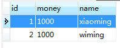
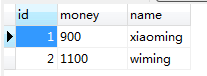

[TOC]

# SSH与SSM学习之Spring22——Spring事务之xml配置方式管理事务

## 一、导包

Spring AOP包
```xml
spring-aop

spring-aspects

org.aspectj.weaver

org.aopalliance
```


---

## 二、AccountSeviceImpl类

Dao接口以及实现、Service接口和之前的是一样的，AccountSeviceImpl不一样，如下

```java
package com.qwm.spring3.tx.service;

import com.qwm.spring3.tx.dao.AccountDao;
import org.springframework.transaction.TransactionStatus;
import org.springframework.transaction.annotation.Isolation;
import org.springframework.transaction.annotation.Propagation;
import org.springframework.transaction.annotation.Transactional;
import org.springframework.transaction.support.TransactionCallback;
import org.springframework.transaction.support.TransactionCallbackWithoutResult;
import org.springframework.transaction.support.TransactionTemplate;

/**
 * @author：qiwenming
 * @date：2017/10/31 0031   21:02
 * @description：
 */
public class AccountServiceImpl implements AccountService {

    private AccountDao ad;
    private TransactionTemplate tt;

    @Override
    public void updateMoney(Long fromId, Long toId, Double money) {
        //减钱
        ad.decreaseMoney(fromId,money);
//        int i = 1/0;
        //加钱
        ad.increaseMoney(toId,money);
    }


    public void setAd(AccountDao ad) {
        this.ad = ad;
    }

    public void setTt(TransactionTemplate tt) {
        this.tt = tt;
    }
}
```

---

## 三、配置

### 3.1 配置通知
```xml
<!--配置事务通知-->
    <tx:advice id="txAdvice" transaction-manager="transactionManager">
        <tx:attributes>
            <!-- 以方法为单位,指定方法应用什么事务属性
                isolation:隔离级别
                propagation:传播行为
                read-only:是否只读
             -->
            <tx:method name="save*" isolation="REPEATABLE_READ" propagation="REQUIRED" read-only="false"/>
            <tx:method name="persist*" isolation="REPEATABLE_READ" propagation="REQUIRED" read-only="false"/>
            <tx:method name="update*" isolation="REPEATABLE_READ" propagation="REQUIRED" read-only="false"/>
            <tx:method name="modify*" isolation="REPEATABLE_READ" propagation="REQUIRED" read-only="false"/>
            <tx:method name="delete*" isolation="REPEATABLE_READ" propagation="REQUIRED" read-only="false"/>
            <tx:method name="remove*" isolation="REPEATABLE_READ" propagation="REQUIRED" read-only="false"/>
            <tx:method name="get*" isolation="REPEATABLE_READ" propagation="REQUIRED" read-only="true"/>
            <tx:method name="find*" isolation="REPEATABLE_READ" propagation="REQUIRED" read-only="true"/>
        </tx:attributes>
    </tx:advice>
```

### 3.2 配置将通知织入目标

```xml
  <!--配置织入-->
    <aop:config>
        <!--配置切入点表达式-->
        <aop:pointcut id="txPc" expression="execution(* com.qwm.spring3.tx.service.*ServiceImpl.*(..))"/>
        <!--配置切面：通知+切点-->
        <aop:advisor advice-ref="txAdvice" pointcut-ref="txPc"/>
    </aop:config>
```

### 3.3 完整配置

```xml
<?xml version="1.0" encoding="UTF-8" ?>
<beans xmlns:xsi="http://www.w3.org/2001/XMLSchema-instance"
       xmlns="http://www.springframework.org/schema/beans"
       xmlns:context="http://www.springframework.org/schema/context"
       xmlns:aop="http://www.springframework.org/schema/aop"
       xmlns:tx="http://www.springframework.org/schema/tx"
       xsi:schemaLocation="http://www.springframework.org/schema/beans
            http://www.springframework.org/schema/beans/spring-beans-4.3.xsd
            http://www.springframework.org/schema/context
            http://www.springframework.org/schema/context/spring-context-4.3.xsd
            http://www.springframework.org/schema/aop
            http://www.springframework.org/schema/aop/spring-aop-4.3.xsd
            http://www.springframework.org/schema/tx
            http://www.springframework.org/schema/tx/spring-tx-4.3.xsd ">

    <!-- 1.指定spring读取db.properties配置-->
    <context:property-placeholder location="classpath:com/qwm/spring3/db.properties"/>

    <!--2.将连接池对象放入到spring容器中-->
    <bean name="dataSource" class="com.mchange.v2.c3p0.ComboPooledDataSource">
        <property name="jdbcUrl" value="${jdbc.jdbcUrl}"/>
        <property name="driverClass" value="${jdbc.driverClass}"/>
        <property name="user" value="${jdbc.user}"/>
        <property name="password" value="${jdbc.password}"/>
    </bean>

    <!-- 3.将AccountDao放入到spring 容器中 -->
    <bean name="accountDao" class="com.qwm.spring3.tx.dao.AccountDaoImpl">
        <property name="dataSource" ref="dataSource"/>
    </bean>

    <!--事务核心管理器，封装了所有事务操作，依赖于连接池-->
    <bean name="transactionManager" class="org.springframework.jdbc.datasource.DataSourceTransactionManager">
        <property name="dataSource" ref="dataSource"/>
    </bean>

    <!--事务模板对象-->
    <bean name="transactionTemplate" class="org.springframework.transaction.support.TransactionTemplate">
        <property name="transactionManager" ref="transactionManager"/>
    </bean>

    <!--配置事务通知-->
    <tx:advice id="txAdvice" transaction-manager="transactionManager">
        <tx:attributes>
            <!-- 以方法为单位,指定方法应用什么事务属性
                isolation:隔离级别
                propagation:传播行为
                read-only:是否只读
             -->
            <tx:method name="save*" isolation="REPEATABLE_READ" propagation="REQUIRED" read-only="false"/>
            <tx:method name="persist*" isolation="REPEATABLE_READ" propagation="REQUIRED" read-only="false"/>
            <tx:method name="update*" isolation="REPEATABLE_READ" propagation="REQUIRED" read-only="false"/>
            <tx:method name="modify*" isolation="REPEATABLE_READ" propagation="REQUIRED" read-only="false"/>
            <tx:method name="delete*" isolation="REPEATABLE_READ" propagation="REQUIRED" read-only="false"/>
            <tx:method name="remove*" isolation="REPEATABLE_READ" propagation="REQUIRED" read-only="false"/>
            <tx:method name="get*" isolation="REPEATABLE_READ" propagation="REQUIRED" read-only="true"/>
            <tx:method name="find*" isolation="REPEATABLE_READ" propagation="REQUIRED" read-only="true"/>
        </tx:attributes>
    </tx:advice>

    <!--配置织入-->
    <aop:config>
        <!--配置切入点表达式-->
        <aop:pointcut id="txPc" expression="execution(* com.qwm.spring3.tx.service.*ServiceImpl.*(..))"/>
        <!--配置切面：通知+切点-->
        <aop:advisor advice-ref="txAdvice" pointcut-ref="txPc"/>
    </aop:config>

    <!--4.将AccountService放入到spring容器中-->
    <bean name="accountService" class="com.qwm.spring3.tx.service.AccountServiceImpl">
        <property name="ad" ref="accountDao"/>
        <property name="tt" ref="transactionTemplate"/>
    </bean>
</beans>
```

---

## 四、测试

测试之前，先把数据库中表的数据恢复到初始值



测试代码

```java
/**
 * @author：qiwenming
 * @date：2017/10/31 0031   21:32
 * @description：
 */
@RunWith(SpringJUnit4ClassRunner.class)
@ContextConfiguration("classpath:com/qwm/spring3/tx/applicationContext.xml")
public class Demo {

    @Resource(name = "accountService")
    private AccountService as;

    @Test
    public void test1(){
        as.updateMoney(1L,2L,100D);
    }

}
```

结果



---

## 五、源码下载

[https://github.com/wimingxxx/spring01/tree/master/src/com/qwm/spring3/tx](https://github.com/wimingxxx/spring01/tree/master/src/com/qwm/spring3/tx)